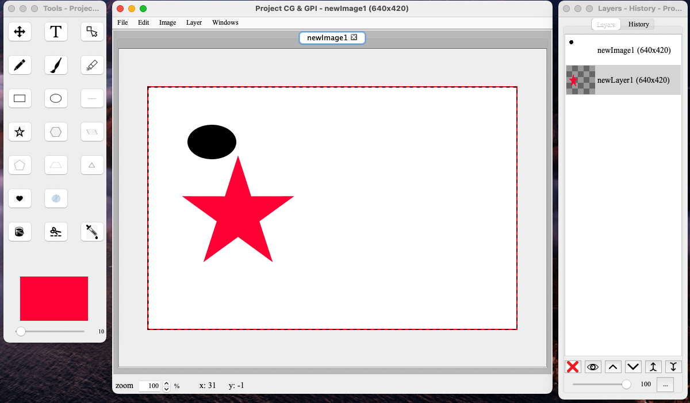

# Project CG & GPI

The project specifications and manuals for the end user:

* the project is written for JDK 8

Saving the whole project with the layers and history of the actions requires you 
to save with the file extension ".proj". If you don't save your working project with 
the required file extension ".proj" the program will it saves the working image 
to ".png" and the layers and history of actions will be lost!

Added new way to directly write the file compressed to make the project file smaller 
Now when you save the whole project you can specify  ".proj.gz" after your preferred file
name.

#### Warning after you save the file with ".proj.gz" you SHOULD manually extract the file from the archive and then open it from the drawing app!

# Images 

